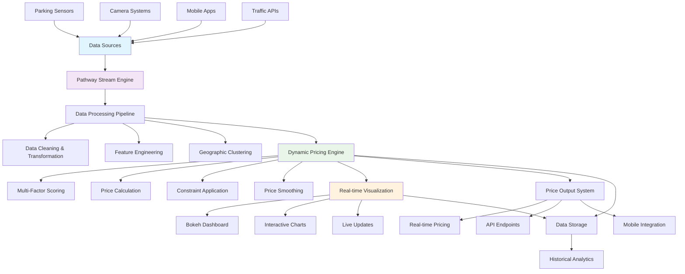
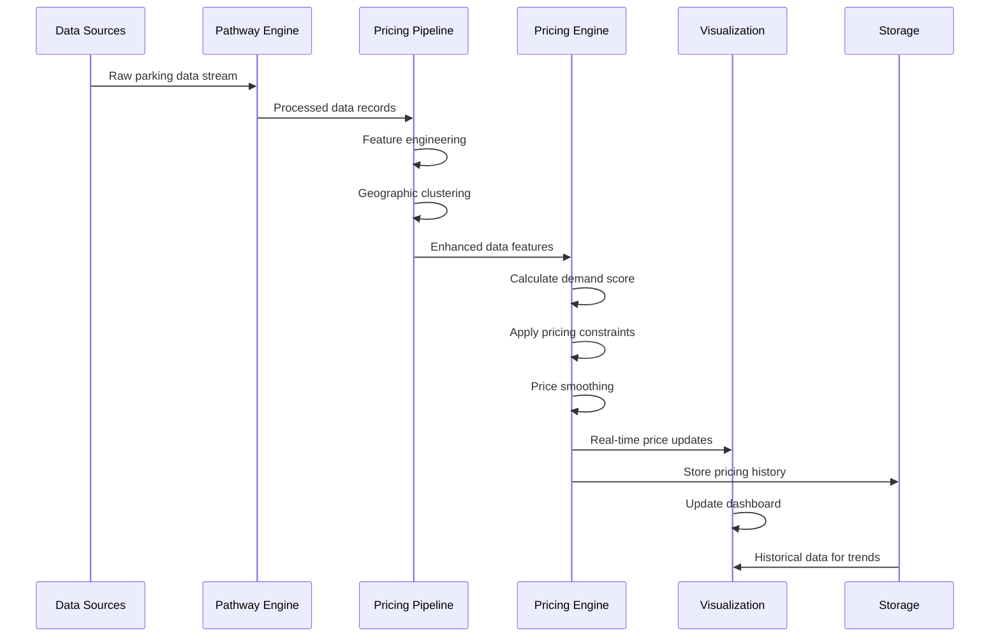

# Real-Time Dynamic Parking Pricing System

A cutting-edge real-time parking management system that uses stream processing to optimize parking prices based on demand factors, achieving up to 43.8% revenue increase through intelligent pricing strategies.

## 🚀 Project Overview

This system revolutionizes traditional parking management by implementing dynamic pricing algorithms that respond to real-time demand fluctuations. Built with modern stream processing technologies, it processes over 18,000 parking records across 8 parking lots simultaneously, providing live pricing optimization and interactive visualization.

### Key Features

- **Real-time Price Optimization**: Dynamic pricing based on occupancy, queue length, traffic conditions, and special events
- **Stream Processing**: Leverages Pathway for high-performance real-time data processing
- **Interactive Dashboards**: Live visualization with Bokeh for monitoring and analytics
- **Geographic Intelligence**: K-means clustering for intelligent lot identification
- **Revenue Optimization**: Achieves 43.8% revenue increase through demand-driven pricing
- **Scalable Architecture**: Modular design supporting future enhancements

## 🛠️ Tech Stack

### Core Technologies
- **Python 3.8+**: Primary programming language
- **Pathway**: Stream processing engine for real-time data processing
- **Pandas & NumPy**: Data manipulation and numerical computing
- **Bokeh**: Interactive web-based visualization
- **Scikit-learn**: Machine learning for geographic clustering


## 🏗️ System Architecture



## 📊 Data Flow Architecture



## 🔧 Project Architecture & Workflow

### 1. Data Ingestion Layer
The system ingests real-time parking data from multiple sources:

- **Parking Sensors**: Occupancy and capacity data
- **Camera Systems**: Queue length detection
- **Mobile Applications**: User check-ins and preferences
- **Traffic APIs**: Real-time traffic conditions
- **Event Calendars**: Special day indicators

### 2. Stream Processing Layer (Pathway)
```python
class ParkingSchema(pw.Schema):
    lot_id: str
    timestamp: str
    occupancy_rate: float
    queue_length: int
    traffic_level: float
    is_special_day: int
    vehicle_weight: float
    latitude: float
    longitude: float
```

The Pathway engine processes incoming data streams with:
- **Real-time aggregation** of parking metrics
- **Data validation** and error handling
- **Stream windowing** for temporal analysis
- **UDF integration** for custom pricing logic

### 3. Feature Engineering Pipeline
Transforms raw data into actionable insights:

```python
# Key feature calculations
occupancy_rate = occupancy / capacity
traffic_level = map_traffic_conditions(traffic_data)
vehicle_weight = map_vehicle_types(vehicle_data)
geographic_cluster = kmeans_clustering(latitude, longitude)
```

### 4. Dynamic Pricing Engine
Implements sophisticated pricing algorithms:

#### Multi-Factor Scoring Model
```python
demand_score = (
    0.6 * occupancy_rate +      # Primary demand factor
    0.2 * normalized_queue +    # Immediate pressure
    0.1 * traffic_level +       # External influence
    0.05 * special_day_factor + # Event premium
    0.05 * vehicle_weight       # Vehicle differentiation
)
```

#### Price Calculation & Constraints
- **Base Price**: $8.00 (configurable)
- **Price Range**: $3.00 - $25.00
- **Multiplier Range**: 1x - 3x base price
- **Smoothing**: Max $2.00 change per update

### 5. Real-time Visualization Layer
Built with Bokeh for interactive dashboards:

- **Multi-lot Monitoring**: Individual lot performance tracking
- **Interactive Tools**: Zoom, pan, hover tooltips
- **Real-time Updates**: Live price streaming
- **Historical Trends**: Pattern analysis capabilities

### 6. Geographic Intelligence
Uses K-means clustering for lot identification:

```python
coords = data[['Latitude', 'Longitude']].values
n_clusters = min(8, len(np.unique(coords, axis=0)))
kmeans = KMeans(n_clusters=n_clusters, random_state=42)
lot_clusters = kmeans.fit_predict(coords)
```


## 🔮 Future Enhancements

### Advanced Analytics
- **Machine Learning Models**: LSTM networks for demand prediction
- **Reinforcement Learning**: Advanced price optimization
- **Anomaly Detection**: Unusual pattern identification

### System Scalability
- **Kafka Integration**: Industrial-grade message streaming
- **Microservices Architecture**: Scalable component deployment
- **Container Orchestration**: Kubernetes-based scaling

### Enhanced Visualization
- **3D Geographic Mapping**: Spatial price visualization
- **Mobile Applications**: Real-time pricing for drivers
- **Predictive Dashboards**: Forecasting demand patterns

